# Programa de Calculadoras em C
Programa que integra calculadoras específicas em C!

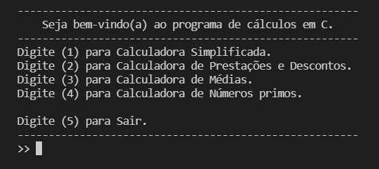 

 

> **Obs.:** Caso compile em um ambiente linux, é recomendável que converta os códigos-fontes de ISO-8859-1 para UTF-8. 
>  - **Comando**: iconv -f [codificação de origem] -t [codificação de destino] arquivo > arquivo.new

 

# Calculadoras: 
 - **Calculadora Simplificada:**

    Calculadora que realiza as 6 operações básicas da aritmética (Soma, Subtração, Multiplicação, Divisão, Potenciação e Radiciação). O programa solicita ao usuário qual operação deseja realizar e quais os dois números que serão operados no cálculo efetuado. Ao  final, o  programa exibe o resultado e pergunta se deseja realizar mais alguma operação.  

    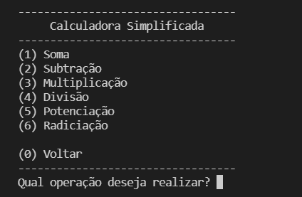 
    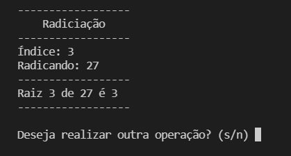 
    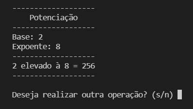 
    
#  

- **Calculadora de prestações e Descontos:**

    Recebe do usuário o valor de um produto e a forma de pagamento. Se o pagamento for à vista, o programa calcula o valor final com 10% de desconto. Se o pagamento for à prazo, o programa pergunta o número de parcelas e depois calcula o valor de cada parcela.
 
    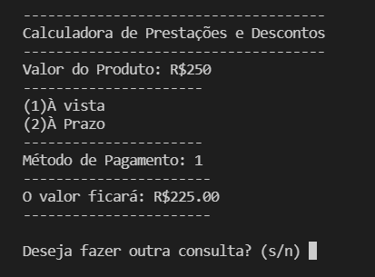 
    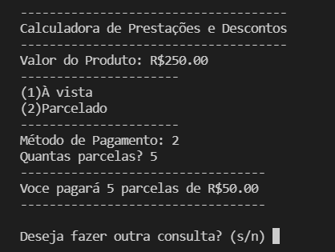 
    
#  

- **Calculadora de Médias:**

    Implementa um programa que calcula a média de acordo com as regras da Estácio* para aprovação e diz se o aluno está aprovado ou não. O programa verifica a quantidade de faltas do aluno e determina se ele faltou mais do que 25% das aulas (Assumindo que o número total de aulas é 16).

    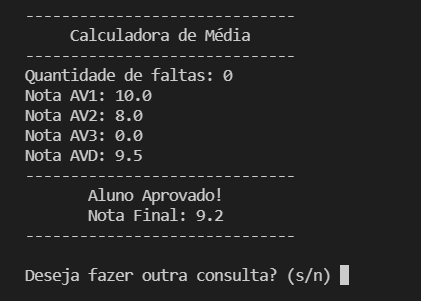 
    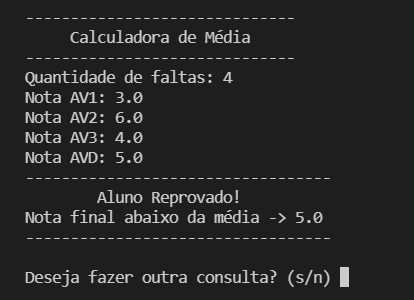 
    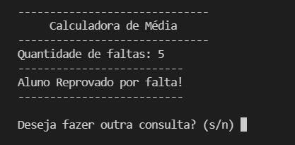 
    
#  

- **Calculadora de Números Primos:**

    Solicita que o usuário digite um número inteiro. O programa então deve descobrir qual o MAIOR número primo que seja MENOR ou IGUAL ao número  digitado.

    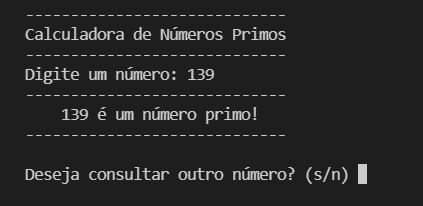 
    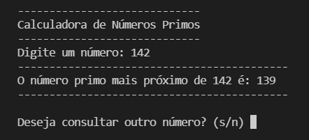 